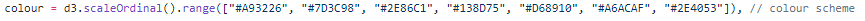
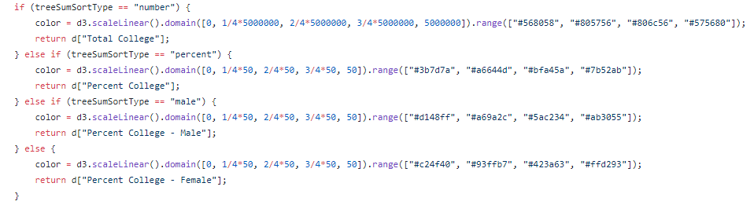
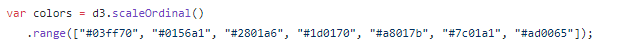
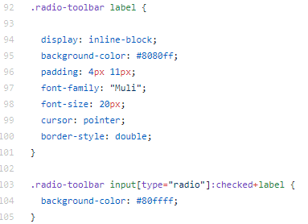
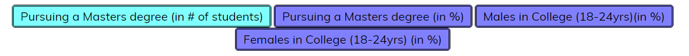
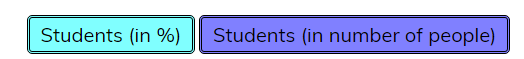

# Τελική αναφορά του μαθήματος Επικοινωνία Ανθρώπου-Υπολογιστή
### Ονοματεπώνυμο:Πλιάφας Θεόδωρος
### Αριθμός Μητρώου:Π2017012

#### [Link αποθετηρίου](https://github.com/Thodoros/D3js-US-educational-attainment)
#### [Εκτελέσιμο link](https://thodoros.github.io/D3js-US-educational-attainment/)

## Εισαγωγή
Η εργασία αυτή έχει ως στόχο στην εκμάθηση τριών γλωσσών(html,css,javascript) που χρησιμοποιούνται στο Web μέσω καποιών αλλαγών που πρέπει να γίνουν σε ήδη υπάρχοντα κώδικα.Η αναφορά αυτή περιέχει εικόνες καθώς και gifs από τα αποτελέσματα που που βγαίνουν,έπειτα από τις αλλαγές που ζητούνται στον κώδικα.Εκτός από το τελευταίο ζητούμενο του 1ου παραδοτέου,στο οποίο δε κατάφερα να κάνω τα διαγράμματα responsive, και στο 2ο ζητούμενο του 2ου παραδοτέου τα υπόλοιπα ζητούμενα υλοποιήθηκαν χωρίς κάποιο πρόβλημα ή δυσκολία.

## Σύντομη ανάλυση σχετικών έργων και εργαλείων
Για την υλοποίηση της εργασίας χρησιμοποίηθηκε εκτός από το github και το notepad++ για να υπάρχει η δυνατότητα τα αποτελέσματα να φαίνονται αυτόματα,γιατί αρκετές φορές το github αργεί να φορτώσει τις νέες αλλαγές.Επίσης,χρησιμοποιήθηκαν και εκπαιδετικές ιστοσελίδες όπως [W3Schools](https://www.w3schools.com/),[Stack Overflow](https://stackoverflow.com/) και [Html dog](http://www.htmldog.com/) για την αναζήτηση παραδειγμάτων για το τρόπο λειτουργίας των γλωσσών καθώς και το [CodePen](https://codepen.io/) για την άντληση παραδειγμάτων σχετικά με τα διαγράμματα της [D3.js](https://d3js.org/).

## Mέθοδος και τεχνικές ανάπτυξης

### Πρώτο Παραδοτέο

### 1ο ζητούμενο
Για την αλλαγή χρωμάτων στα διαγράμματα,αλλάχτηκαν τα χρώματα που βρίσκοταν(σε hex μορφή) στα:[script_1.js](https://github.com/Thodoros/D3js-US-educational-attainment/blob/master/assets/scripts/script_1.js) για το πρώτο γράφημα,[script_2.js](https://github.com/Thodoros/D3js-US-educational-attainment/blob/master/assets/scripts/script_2.js) για το δεύτερο γράφη,α,[script_3.js](https://github.com/Thodoros/D3js-US-educational-attainment/blob/master/assets/scripts/script_3.js) για το τρίτο γράφημα.

#### 1ο γράφημα

#### 2ο γράφημα

#### 3ο γράφημα

### 2ο ζητούμενο
Για την αλλαγή των διεπαφών στα κούμπια,αλλάχτηκε ο κώδικας στο [style.css](https://github.com/Thodoros/D3js-US-educational-attainment/blob/master/assets/stylesheets/style.css) και άλλαξε το χρώμα τον κουμπιών και το περίγραμμα.

### 3ο ζητούμενο
Για να ακούγεται ο ήχος στο μενού ανέβασα δύο αρχεία ήχου [mouse-click .ogg](https://github.com/Thodoros/D3js-US-educational-attainment/blob/master/mouse-click%20.ogg) και [mouse-click.mp3](https://github.com/Thodoros/D3js-US-educational-attainment/blob/master/mouse-click.mp3) καθώς και το αρχείο [sound-menu-mouseover.js](https://github.com/Thodoros/D3js-US-educational-attainment/blob/master/sound-menu-mouseover.js).
Έπειτα,εισήχθηκε στο [index.html](https://github.com/Thodoros/D3js-US-educational-attainment/blob/master/index.html) ένα script tag,μία συνάρτηση onmouseover="playclip();" και ένα audio tag.

